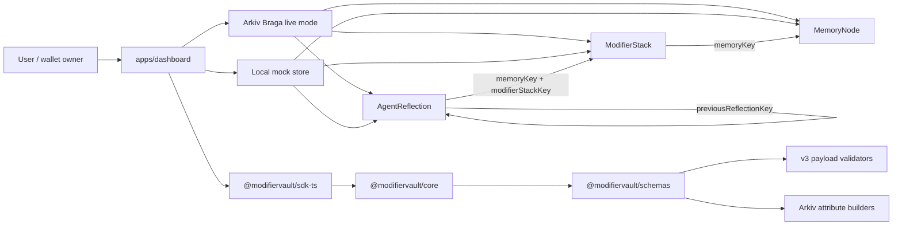

# ModifierVault

ModifierVault is user-owned AI memory infrastructure. It represents memory as a portable semantic graph instead of hidden platform state, so a user can inspect, query, export, encrypt, and reinterpret what an agent remembers.

The project namespace is:

```txt
PROJECT_ATTRIBUTE = "modifiervault_beaconsmith_ethns_2026"
schemaVersion = "3"
```

## Product Pitch

Most AI memory is opaque: the platform decides what is remembered, how it is reused, and whether the user can move it elsewhere. ModifierVault makes memory explicit. A memory becomes a `MemoryNode`; reuse instructions become `ModifierStack` records; generated interpretations become `AgentReflection` artifacts with lineage hashes. The same base memory can produce different interpretations without rewriting the memory itself.

Demo memory:

```txt
I avoid decisions until I can model tradeoffs.
```

Demo modifier stacks:

- A: `["route:strategy", "expand", "remember"]`
- B: `["route:product", "transform:design"]`
- C: `["protect", "compress"]`

## Architecture



Workspace layout:

```txt
apps/dashboard       Next.js dashboard and Arkiv integration
packages/schemas    TypeScript types, Zod validators, attribute builders
packages/core       Graph operations, local store, prompt/hash/encryption helpers
packages/sdk-ts     ModifierVault SDK facade
docs                Architecture, security, Arkiv, demo, evidence notes
examples            Runnable SDK examples
scripts             Local and Braga verification scripts
```

## Entity Model

`MemoryNode` payload:

```ts
{
  entityType: "MemoryNode",
  schemaVersion: "3",
  title: string,
  domain: string,
  contentMode: "plaintext" | "metadata-only" | "encrypted",
  content?: string,
  contentPreview?: string,
  encryptedContent?: EncryptedPayloadEnvelope,
  createdAt: string
}
```

`ModifierStack` payload:

```ts
{
  entityType: "ModifierStack",
  schemaVersion: "3",
  memoryKey: string,
  modifiers: string[],
  interpreter: string,
  authority: "user" | "agent" | "shared",
  context: string,
  createdAt: string
}
```

`AgentReflection` payload:

```ts
{
  entityType: "AgentReflection",
  schemaVersion: "3",
  memoryKey: string,
  modifierStackKey: string,
  previousReflectionKey?: string,
  lineageDepth: number,
  model: string,
  interpreter: string,
  contentMode: "plaintext" | "metadata-only" | "encrypted",
  reflection?: string,
  encryptedReflection?: EncryptedPayloadEnvelope,
  promptHash: string,
  outputHash: string,
  createdAt: string
}
```

Arrays live in payload only. Modifier values are also emitted as repeated queryable Arkiv attributes, one per value.

## SDK Usage

```ts
import { ModifierVault } from "@modifiervault/sdk-ts";

const vault = ModifierVault.local({ owner: "0xowner", creator: "0xcreator" });

const memory = await vault.createMemory({
  title: "Tradeoff delay",
  domain: "personal-cognition",
  contentMode: "plaintext",
  content: "I avoid decisions until I can model tradeoffs.",
});

const stack = await vault.attachModifierStack({
  memoryKey: memory.key,
  modifiers: ["route:strategy", "expand", "remember"],
  interpreter: "beaconsmith:v1",
  authority: "user",
  context: "Reuse this as a decision strategy.",
});

await vault.createReflection({
  memoryKey: memory.key,
  modifierStackKey: stack.key,
  lineageDepth: 0,
  model: "local-reflector",
  interpreter: "beaconsmith:v1",
  contentMode: "plaintext",
  reflection: "Delay preserves optionality until tradeoffs are visible.",
});

const graph = await vault.exportGraph(memory.key);
```

Run the example:

```bash
npm run example:local-sdk
```

## Setup

```bash
npm install
npm run dev
```

Open `http://localhost:3000`.

Local mock mode is the default:

```bash
NEXT_PUBLIC_MODIFIERVAULT_STORAGE=local
```

Arkiv live mode:

```bash
NEXT_PUBLIC_MODIFIERVAULT_STORAGE=arkiv
NEXT_PUBLIC_ARKIV_RPC_URL=https://braga.hoodi.arkiv.network/rpc
NEXT_PUBLIC_ARKIV_EXPLORER_URL=https://explorer.braga.hoodi.arkiv.network
NEXT_PUBLIC_ARKIV_EXPIRES_IN_SECONDS=2592000
GROQ_API_KEY=your_server_side_key
GROQ_MODEL=llama-3.1-8b-instant
```

For CLI Braga verification:

```bash
ARKIV_PRIVATE_KEY=0xYOUR_BRAGA_TESTNET_PRIVATE_KEY
npm run test:braga
```

Never expose private keys or AI provider keys as `NEXT_PUBLIC_*`.

## Demo Flow

1. Run `npm run dev`.
2. Open `/query` and inspect the seeded local graph.
3. Open the first `MemoryNode` from the query results.
4. Confirm `/memory/[key]` reconstructs one memory, three modifier stacks, and linked reflections.
5. Open `/create`, save a new local memory, and inspect the generated local entity keys.
6. Open `/sdk` for the SDK usage surface.
7. Open `/research` for the thesis, demo scenario, and evidence shape.
8. For live mode, set `NEXT_PUBLIC_MODIFIERVAULT_STORAGE=arkiv`, connect a browser wallet on Braga, and repeat the create/read/query flow.

## Arkiv Compliance Table

| Requirement | Implementation |
| --- | --- |
| Project filter on every entity/query | `project = "modifiervault_beaconsmith_ethns_2026"` attribute |
| Schema filter | `schemaVersion = "3"` payload field and attribute |
| Entity type filter | `entityType` payload field and attribute |
| Required created timestamp | `createdAt` payload field and attribute |
| MemoryNode query attributes | `domain`, `contentMode` |
| ModifierStack query attributes | `memoryKey`, `interpreter`, `authority`, one `modifier__*` attribute per modifier |
| AgentReflection query attributes | `memoryKey`, `modifierStackKey`, `previousReflectionKey`, `interpreter`, `model`, `lineageDepth` |
| Arrays in payload only | `modifiers` is payload-only; query attributes are repeated scalar flags |
| Local mock mode | `apps/dashboard/src/lib/local-vault.ts` stores the same v3 payloads and attributes |
| Live Arkiv mode | `apps/dashboard/src/lib/arkiv.ts` writes with `@arkiv-network/sdk` |

## Verification

```bash
npm run verify
```

This runs lint, schema/core/sdk/dashboard local-mode tests, smoke tests, and the dashboard production build.

More detail:

- [Architecture](docs/ARCHITECTURE.md)
- [Security notes](docs/SECURITY_NOTES.md)
- [Arkiv notes](docs/ARKIV_NOTES.md)
- [Demo script](docs/DEMO_SCRIPT.md)
- [Evidence](docs/EVIDENCE.md)

## License

MIT. See [LICENSE](LICENSE).
