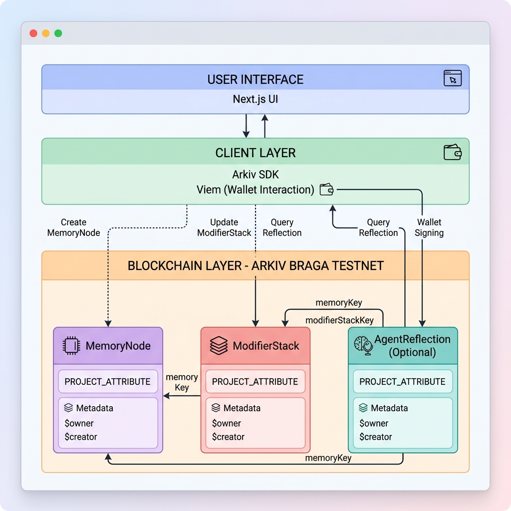
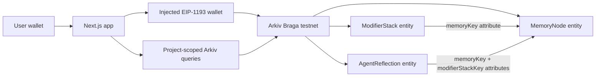

# ModifierVault

User-owned AI memory on Arkiv Braga testnet.

[Live demo](https://modifiervault.vercel.app) | [Arkiv docs](https://docs.arkiv.network/) | [Submission form](https://forms.arkiv.network/ethns-arkiv-challenge)

## Theme

**Theme: AI.** ModifierVault demonstrates agents whose memory is owned by the user, not the platform. A connected wallet writes AI memory objects to Arkiv, then reads and queries them back through Arkiv attributes.

Privacy is treated as a design constraint in this MVP: entities include visibility metadata and wallet ownership, but payloads are intentionally transparent on the public Braga testnet. Do not store sensitive plaintext in the demo.

## What It Does

ModifierVault stores a small AI memory graph on Arkiv:

- `MemoryNode`: the user-owned memory payload.
- `ModifierStack`: queryable instructions that describe how an agent should expand, route, transform, or remember the memory.
- `AgentReflection`: an optional third entity that records a later agent interpretation linked back to the memory and stack.

Every entity and every query uses this unique project attribute:

```txt
project = "modifiervault_beaconsmith_ethns_2026"
```

## Architecture





Key Arkiv concepts used:

- Payloads are JSON and use `contentType: "application/json"`.
- Attributes power indexing and relationships.
- `expiresIn` is configurable through `NEXT_PUBLIC_ARKIV_EXPIRES_IN_SECONDS`.
- `$owner` is the wallet that can update/delete an entity.
- `$creator` is immutable attribution for who created the entity.

## Tech Stack

- Next.js App Router, React, TypeScript
- Arkiv SDK `@arkiv-network/sdk`
- Viem wallet transport for browser signing
- Vercel deployment
- MIT license

## Braga Network

The app targets Arkiv Braga:

```txt
Chain ID: 60138453102
RPC URL: https://braga.hoodi.arkiv.network/rpc
Explorer: https://explorer.braga.hoodi.arkiv.network
Entity explorer: https://data.arkiv.network
```

## Setup

Prerequisites:

- Node.js 20+
- npm
- A browser wallet with Braga testnet GLM for writes

Install and run locally:

```bash
npm install
cp .env.example .env.local
npm run dev
```

Open `http://localhost:3000`.

Environment variables:

```bash
NEXT_PUBLIC_ARKIV_RPC_URL=https://braga.hoodi.arkiv.network/rpc
NEXT_PUBLIC_ARKIV_EXPLORER_URL=https://explorer.braga.hoodi.arkiv.network
NEXT_PUBLIC_ARKIV_EXPIRES_IN_SECONDS=2592000

# Optional. Needed only for the CLI smoke test.
ARKIV_PRIVATE_KEY=0xYOUR_BRAGA_TESTNET_PRIVATE_KEY
```

Never expose a private key as `NEXT_PUBLIC_*`.

## Demo Flow

1. Open the [live demo](https://modifiervault.vercel.app).
2. Go to `/create`.
3. Connect a browser wallet and switch to Arkiv Braga when prompted.
4. Create the seeded `MemoryNode` and linked `ModifierStack`.
5. Open the generated `/memory/[key]` route to inspect owner, creator, payload, attributes, and linked entities.
6. Go to `/query` and search by modifier, memory key, or the project-scoped default query.
7. Optionally add an `AgentReflection` to show agent memory continuing under the user's wallet.

## Verification

Local checks:

```bash
npm run lint
npm run build
```

Braga smoke test:

```bash
# Requires ARKIV_PRIVATE_KEY in .env.local
npm run test:braga
```

The smoke test creates a `MemoryNode`, reads it back by key, then queries by `PROJECT_ATTRIBUTE` and `entityType`.

Recent verification evidence is tracked in [VERIFICATION.md](VERIFICATION.md).

## Submission Info

| Field | Value |
| --- | --- |
| Theme | AI |
| GitHub repo | https://github.com/beaconsmith/arkiv-modifier-vault |
| Demo link | https://modifiervault.vercel.app |
| Demo video | Optional for submission; required for prize claim |
| Team | Beaconsmith Team |
| GitHub handle | `beaconsmith` |
| Prize wallet | `0x7c2435c6e148cd2d936d2afcb73ec741ec7effb2` |

Submit at: https://forms.arkiv.network/ethns-arkiv-challenge

## Demo Video Outline

Suggested 2-3 minute structure for the prize-claim video:

1. Show the theme: user-owned AI memory, not platform-owned memory.
2. Open `/create`, connect wallet, and create a memory graph on Braga.
3. Open the memory detail route and point out `$owner`, `$creator`, attributes, payload, and entity keys.
4. Query by project and modifier on `/query`.
5. Add an `AgentReflection` and show how it links back through attributes.

## License

MIT. See [LICENSE](LICENSE).
