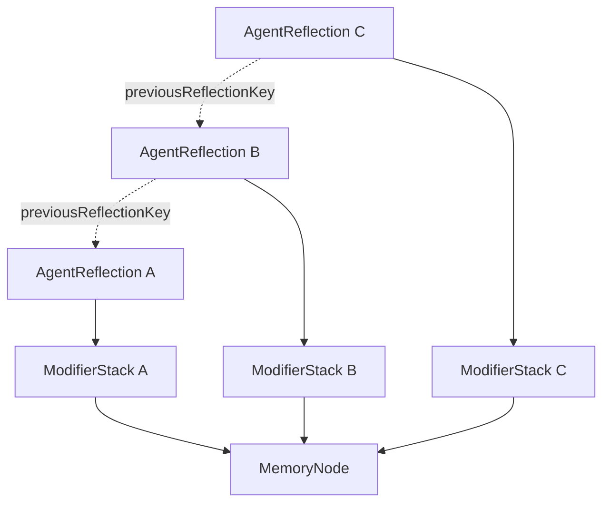

# Architecture

ModifierVault is organized as a monorepo so the memory graph contract can exist independently from the dashboard.

```txt
apps/dashboard
packages/schemas
packages/core
packages/sdk-ts
docs
examples
scripts
```

## Package Roles

`packages/schemas`

- TypeScript payload types.
- Zod validators for exact v3 payload shapes.
- Arkiv attribute builders.
- Modifier normalization and repeated modifier attribute keys.

`packages/core`

- Entity draft builders: `createMemoryNode`, `attachModifierStack`, `createAgentReflection`.
- `LocalMemoryStore` for storage-independent tests and SDK use.
- Graph operations: `queryMemoryGraph`, `exportMemoryGraph`, `validateMemoryGraph`.
- Prompt, hash, and encryption helpers.

`packages/sdk-ts`

- `ModifierVault` class.
- Local mode factory: `ModifierVault.local()`.
- Methods: `createMemory`, `attachModifierStack`, `createReflection`, `queryGraph`, `searchByModifier`, `searchByInterpreter`, `exportGraph`.

`apps/dashboard`

- Next.js App Router UI.
- Local mock mode by default.
- Arkiv live mode when `NEXT_PUBLIC_MODIFIERVAULT_STORAGE=arkiv`.
- Routes: `/`, `/create`, `/query`, `/memory/[key]`, `/sdk`, `/research`.

## Graph Model



The base memory is not mutated when an agent interprets it. Each `ModifierStack` defines a reuse frame, and each `AgentReflection` records one interpretation artifact.

## Local And Live Storage

Local mock mode stores the same payload and attribute records in browser `localStorage` or an in-memory state during Node tests. It exists so users can run the full graph flow without a wallet.

Live mode writes to Arkiv Braga using `@arkiv-network/sdk`. The dashboard signs through an injected EIP-1193 wallet and queries by scalar attributes.

## Relationship Reconstruction

`/memory/[key]` reconstructs a graph by:

1. Reading the `MemoryNode` by key.
2. Querying `ModifierStack` records with the same `memoryKey`.
3. Querying `AgentReflection` records with the same `memoryKey`.
4. Rendering lineage through `modifierStackKey` and `previousReflectionKey`.

